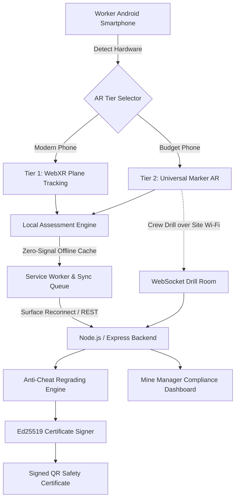

<div align="center">

# 🦺 SafeAR

### Every Worker Trained. Every Certificate Real.

*Inclusive, headset-free AR safety simulator and tamper-proof certification for Jharkhand's mining sector.*

[](https://www.sih.gov.in/)
[](LICENSE)
[](#testing)
<br>
[](backend/)
[](frontend/ar/)
[](backend/services/certs/)
[](capacitor.config.json)

**[The Problem](#the-jharkhand-mining-crisis)** •
**[Why SafeAR?](#why-safear-the-innovation)** •
**[Curriculum](#the-3-phase-industrial-curriculum)** •
**[Architecture](#system-architecture)** •
**[Quickstart](#quickstart--live-demo)**

</div>

---

> **In 30 seconds:** SafeAR turns the ₹8,000 Android phone a mine worker already owns into a safety simulator. A fire appears in the worker's real surroundings. They must read the methane meter, pick the right extinguisher, stand in the right place, pull the pin, aim, sweep and get out, all with their own hands. The phone sends evidence and the server grades it. A pass earns an **Ed25519-signed QR certificate** that no one can forge. It works underground with no signal, and it talks to the worker in their own language.

---

## The Jharkhand Mining Crisis

According to the Directorate General of Mines Safety (DGMS, Dhanbad), **Jharkhand recorded 48 fatal mine accidents in 2022–23**. A disproportionate share involved young recruits with **under 30 days of orientation**. They were not careless. Nobody had really taught them.

Today's training options each fail in a different way:

| Approach | Why it fails the worker |
|---|---|
| 📖 **Classroom manuals** | **Under 20% retention** after one week. Reading about a fire is not facing one. |
| 🔥 **Live drills** | Stop production, carry real risk, and can't be repeated on demand. |
| 🥽 **VR headsets** | **₹50,000+ per unit**, fragile in dusty underground air, and out of reach for contract labourers. |
| 📄 **Paper certificates** | Easy to forge or rubber-stamp. They prove attendance, not understanding. |

The workforce is young and often tribal. Many workers have no prior industrial exposure and are more at home in **Hindi or Santali** than in English. A solution that needs a headset, a classroom, or reading fluency in English leaves out the people it is meant for.

---

## Why SafeAR? The Innovation

### 1. 📱 Inclusive dual-tier AR engine (zero hardware cost)

At start-up, SafeAR checks what the phone can do (`selectArTier`, a pure function) and tells the worker which mode it picked.

| | **Tier 1 — Immersive WebXR** | **Tier 2 — Universal marker AR** |
|---|---|---|
| **Runs on** | ARCore-capable phones | Budget ₹8,000–12,000 phones, *most of our target users* |
| **Tracking** | Markerless: real floor, walls and walking | A printed Hiro/Kanji marker, no plane detection needed |
| **Engine** | WebXR Device API + Three.js | A-Frame + AR.js |

Both tiers show the **same procedural fire and the same scoring**. If a WebXR session fails, the app falls back to marker mode and **says so**. It never downgrades silently. No worker is left out because of the phone they own.

### 2. ✋ Muscle memory, not 2D quizzes

Workers **act**, they don't tap answers. They drag the safety pin out, hold the phone steady on the *base* of the flame, squeeze, and sweep the phone side to side. On Tier 1 phones, the green exit sign snaps flush onto a **real door** and the worker physically walks to it. The phone's own motion is the controller.

### 3. 👷 Collaborative crew drills, no internet needed

Underground, a crew survives by acting in the right order. Three workers on three phones join one drill room over the **site's local Wi-Fi**, and a WebSocket room server on the site machine keeps them in sync. No external internet is needed. The server **enforces the crew's order of operations**:

| Role | Responsibility |
|---|---|
| **Alarm Operator** | Sounds the section alarm first |
| **Extinguisher Operator** | Selects the correct agent and puts the fire out |
| **Backup / Evacuation Coordinator** | Confirms the retreat path once the fire is out |

### 4. 🔐 Offline-first architecture and anti-cheat engine

- **Offline:** every app file (screens, 3D models, narration, translations) is precached by a service worker. Completed runs queue on the phone and **sync automatically** once the phone reaches the site server again.
- **The phone never grades itself.** It sends raw evidence, such as *"picked water, then CO₂, 1.5 s and 2.4 s after the question"* or *"aimed 0.12 m from the fire base for 900 ms"*. The server regrades it against an answer key that never goes over the network. Editing the app to claim 100% still gets you your real score.
- **Scenario lock:** the gas reading, fuel type and airflow come from the run's ID, identically on the phone and the server. Nobody can claim the meter showed something easier.
- **Ed25519-signed QR certificates.** The private key never leaves the server. Change a single digit, such as the score, and verification fails.

### 5. 🗣️ Voice-first, culturally grounded language support

Many target users read little, so **audio is the primary channel** and on-screen text backs it up. Narration is **pre-recorded, one clip per step**, served from the phone, and there is **no live text-to-speech**. For Santali (Ol Chiki script), SafeAR will never use a machine-generated voice: speech technology for Ol Chiki is immature, and a wrong word in a safety instruction is worse than none. Santali narration is being **recorded by human speakers**.

Sound also teaches: a methane-detector chirp that rises in pitch as gas builds, an alarm siren, and a fire roar that drops to a quarter of its volume whenever the narrator speaks.

---

## The 3-Phase Industrial Curriculum

A phase unlocks only when the phase before it is complete.

```
 Phase 1                     Phase 2                          Phase 3
 Know your equipment   ──▶   Solo AR simulation        ──▶   Crew live drill
 (inspect every part)        (5 fail-to-learn gates,         (3 roles, server-
                              ≥ 80% to unlock Phase 3)        enforced order)
```

### Phase 1 — Equipment familiarisation gate

Before any scenario unlocks, the worker inspects each item they will depend on. Each one is a labelled photograph: the extinguisher's safety pin, pressure gauge, valve and nozzle, the multi-gas detector, the breathing apparatus (SCBA) and the harness. They meet the equipment *before* they need it under pressure.

### Phase 2 — Solo AR simulation with fail-to-learn gates

The flagship **Fire & Explosion Response** module puts five decisions in the worker's way. Each one is built around a trap that kills real miners. A wrong choice shows **what would have happened in real life**, locks that option, and makes the worker think again. The mistake still counts on the record.

| Gate | The decision | The deadly trap |
|---|---|---|
| 1. Gas assessment | Evacuate, fight, or wait? | At or above the **1.25% CH₄ withdrawal limit**, fighting the fire is fatal |
| 2. Extinguisher choice | Match the agent to the fire | Water on live switchgear (electrocution), water on burning oil (spread), putting out a gas jet before isolating it (re-ignition) |
| 3. Stand-off and stance | Where to stand in the airflow | Downwind means toxic smoke; closer than 1 m means burns; further than 4 m means the agent never reaches the fire |
| 4. P.A.S.S. aim | Pull, aim, squeeze, sweep | Aiming at the flame tips: the powder passes straight through |
| 5. After the flames | Once the fire looks out | Turning your back while it can still flare up |

**Scoring:** right first time scores 100%, one minor slip 50%, two slips 0%. Any **fatal mistake** scores 0% for that gate and **fails the whole run**, even if the worker corrects it afterwards.

The **Gas Leak & Confined Space** module covers hazard-zone recognition, PPE selection (SCBA, multi-gas detector, harness) and the buddy system. Its core lesson: rushing in to help a collapsed partner is the classic double-fatality trap.

### Phase 3 — Collaborative live drill

The crew runs a synchronised fire emergency together (see [crew drills](#3--collaborative-crew-drills-no-internet-needed)). The server records a timeline of who did what and when, then **scores the crew as a team**.

---

## System Architecture



| Layer | Technology |
|---|---|
| **Frontend** | Plain HTML/CSS/JS ES modules, no build step |
| **AR** | WebXR Device API + Three.js (Tier 1) · A-Frame + AR.js, vendored (Tier 2) |
| **Android** | Capacitor 5.7.4 wraps the same frontend as an installable APK |
| **Offline** | Service worker precache + local attempt queue with automatic sync |
| **Backend** | Node.js + Express 4 · `zod` validation on every request · `pino` structured logs · `ws` drill rooms |
| **Database** | SQLite via `better-sqlite3` |
| **Certificates** | Ed25519 (Node `crypto`) + `qrcode`. `backend/services/certs/` imports nothing from Express, so signing logic is tested and trusted in isolation. |
| **Localization** | `frontend/locales/{en,hi,sat}.json` + static `.mp3` narration per step |

<details>
<summary><b>📁 Repository layout</b></summary>

```
SIH/
├── AGENTS.md              # engineering rules, read first
├── backend/
│   ├── models/            # zod request/response shapes
│   ├── realtime/          # WebSocket crew-drill rooms
│   ├── routes/            # /api/modules, /api/sync, /api/certs, /api/dashboard
│   ├── services/
│   │   ├── certs/         # canonicalise, sign, verify (pure, no Express)
│   │   ├── grading/       # server-side regrading of every attempt
│   │   └── team-drill/    # crew scoring
│   └── tests/
├── frontend/
│   ├── ar/                # tier.js (selectArTier), webxr.js, marker.js
│   ├── assessment/        # session engine + observations
│   ├── modules/           # fire-response/, gas-leak/
│   ├── prerequisite/      # Phase 1 equipment screen
│   ├── locales/, audio/   # en / hi / sat strings and narration
│   ├── markers/           # printable Tier 2 markers
│   └── sw.js              # offline service worker
├── dashboard/             # admin.html (compliance) + mobile/ portal
└── docs/SETUP.md          # full setup and demo guide
```

</details>

---

## Quickstart & Live Demo

**Prerequisites:** Node.js (LTS) and npm. A phone is optional; the browser demo runs on a laptop.

```bash
git clone https://github.com/Kr1shRaj/SIH-Barcelona.git
cd SIH-Barcelona
npm install                  # one install covers backend, frontend and dashboard

cp .env.example .env         # PowerShell: Copy-Item .env.example .env
npm run keygen:dev           # dev-only Ed25519 key; paste the printed lines into .env
                             # also set ADMIN_API_KEY in .env to any long random string
npm run seed                 # demo workers, modules and answer keys
npm run activate -- --worker WRK-0001   # prints a one-time activation code
```

Then run each of these in its own terminal:

```bash
npm run dev:backend          # API + drill rooms   → http://localhost:3000/api/health
npm run dev:frontend         # training app        → http://localhost:5173
npm run dev:dashboard        # compliance dashboard → http://localhost:5174/admin.html
```

> ⚠️ Use `keygen:dev`, **not** `keygen`. The second one rotates the shared team signing key, and every certificate issued before the rotation stops verifying.

### Try it

1. Open **http://localhost:5173** and sign in as `WRK-0001` with the activation code, choosing a PIN. Then pick a language and go through the equipment screen.
2. For marker mode, open or print a marker from `frontend/markers/` (`hiro.html`) and point the camera at it. To force a tier, add `?tier=1` or `?tier=2` to the URL.
3. Play **Fire & Explosion Response**. At Gate 1, try fighting the fire above 1.25% CH₄ to see a fail-to-learn card.
4. Finish the run and watch the certificate appear, or show as *pending* until the phone reaches the server.
5. Open the dashboard at **`/admin.html`** to see compliance by mine and by contractor.

**On a phone:** browsers only give camera access to secure origins. A phone opening the app at a plain `http://192.168.x.x` address gets everything *except* AR. For AR on a handset, build the APK:

```bash
npx cap add android && npx cap sync android && npx cap open android
```

Every environment variable, the team-key vs dev-key rules, and all three demo paths (laptop, phone over Wi-Fi, APK) are in **[docs/SETUP.md](docs/SETUP.md)**.

---

## Testing

```bash
npm run test:backend      # 704 tests: grading, cert signing/tamper checks, sync, drill rooms
npm run test:frontend     # 804 tests: tier selection, AR interactions, offline queue, i18n
npm run test:dashboard    #  77 tests: compliance views
npm run lint              # ESLint across all workspaces
```

**1,585 / 1,585 passing** at the time of writing. Highlights:

- **Tamper tests:** a certificate with an edited score, or one signed by the wrong key, is rejected (`backend/tests/test_cert_signing.test.js`).
- **Contract tests:** every tier and branch the phone can produce syncs, grades and certifies correctly, and every fatal trap blocks certification.
- **Migration safety:** a database holding a real signed certificate is upgraded and the certificate is verified again.

---

## Project Status & Roadmap

| Area | Status |
|---|---|
| Fire & Explosion module: 5 gates, both tiers, procedural fire, airflow and smoke | ✅ Live |
| Gas Leak & Confined Space: hazard zone, PPE, buddy system | ✅ Live · 🛣️ decision gates and a live CH₄/CO/O₂ meter next |
| Server-side anti-cheat grading + Ed25519 QR certificates | ✅ Live |
| 3-role crew drill over site Wi-Fi | ✅ Live |
| Offline training + automatic sync | ✅ Live |
| Hindi and English UI + narration | ✅ Live |
| Santali (Ol Chiki) UI + human narration | 🔧 In progress |
| Android APK (Capacitor configured; camera permission added at packaging) | 🔧 In progress |
| Certificate issuance from Tier 1 (WebXR) solo runs | 🔧 In progress (Tier 2 issues certificates today) |
| Offline inspector scanner (checks certificates underground using only the public key) | 🛣️ Roadmap |
| Periodic re-certification (built in, off until DGMS confirms the statutory interval) | 🛣️ Roadmap |
| Heavy Machinery & Lockout-Tagout module | 🛣️ Roadmap |
| Dashboard fatal-mistake analytics + DGMS inspection export | 🛣️ Roadmap |

> Safety thresholds such as the 1.25% methane withdrawal limit and the extinguisher-to-fire mappings follow our reading of DGMS practice. A DGMS expert must confirm them before any real deployment.

---

## Team

| Member | Focus |
|---|---|
| **Krish** | AR layer: tier selection, WebXR, marker AR, in-AR interactions |
| **Krishna** | Backend: Express API, SQLite, certificate signing, sync |
| **Kaamil** | Content and assessment: module scripts, checkpoints, locales, audio |
| **Sanyam** | Dashboard and packaging: compliance dashboard, Capacitor APK, service worker |

Contributors: read **[AGENTS.md](AGENTS.md)** before opening a PR.

## License

[MIT](LICENSE) © 2026 Krish

<div align="center">
<br>
<b>SafeAR</b>: built for the miners of Jharkhand, for Smart India Hackathon 2026.
</div>
